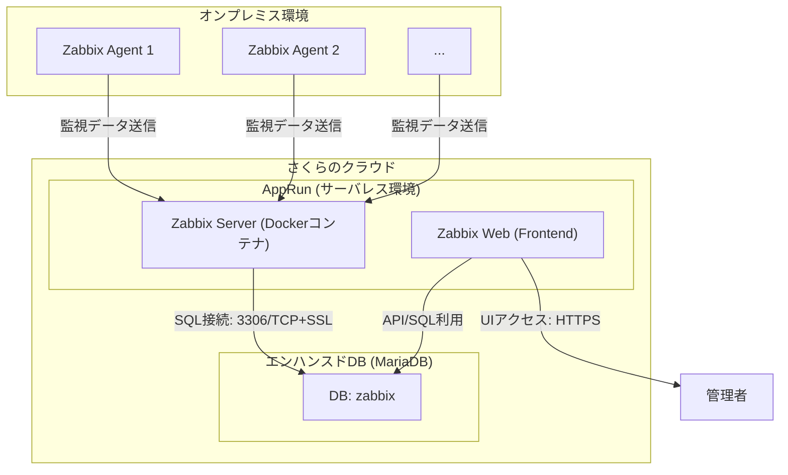

# Zabbix Web/Server を AppRun に建てて宅内の VM の死活監視を行う

## アーキテクチャ

## 技術スタック

| 分類           | 技術・サービス                 | 用途・役割                                  | 備考                  |
| ------------ | ----------------------- | -------------------------------------- | ------------------- |
| **クラウド基盤**   | さくらのクラウド AppRun         | サーバレス環境で Zabbix Server / Web を実行       | コンテナベースで運用可能        |
| **DB**       | エンハンスドデータベース (MariaDB)  | Zabbix のデータ永続化                         | 作成済み DB: `zabbix`   |
| **監視サーバ**    | Zabbix Server (Docker)  | オンプレミスの死活監視・メトリクス収集                    | 公式イメージ使用            |
| **監視フロント**   | Zabbix Web (Docker)     | 管理者向け GUI / ダッシュボード                    | Nginx + PHP + DB接続  |
| **監視対象**     | Zabbix Agent            | 各オンプレミスサーバの死活監視・メトリクス送信                | エージェントをインストールする必要あり |
| **通信**       | SSL / TCP               | Agent ↔ Zabbix Server 間、Server ↔ DB 接続 | セキュア接続を前提           |
| **DBクライアント** | MariaDB クライアント / Docker | 接続確認・スキーマ投入                            | ローカル macOS からの接続に使用 |
| **バックアップ**   | オプション: Object Storage   | DBや設定のバックアップ保管                         | PoCでは未導入でも可         |

## セットアップ

- ad
